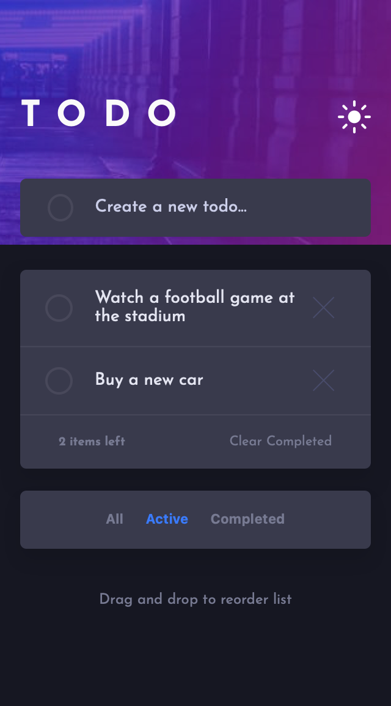

# Frontend Mentor - Todo app solution

This is a solution to the [Todo app challenge on Frontend Mentor](https://www.frontendmentor.io/challenges/todo-app-Su1_KokOW). Frontend Mentor challenges help you improve your coding skills by building realistic projects. 

## Table of contents

- [Overview](#overview)
  - [The challenge](#the-challenge)
  - [Screenshot](#screenshot)
  - [Links](#links)
- [My process](#my-process)
  - [Built with](#built-with)
  - [What I learned](#what-i-learned)
  - [Continued development](#continued-development)
- [Author](#author)

## Overview

### The challenge

Users should be able to:

- View the optimal layout for the app depending on their device's screen size
- See hover states for all interactive elements on the page
- Add new todos to the list
- Mark todos as complete
- Delete todos from the list
- Filter by all/active/complete todos
- Clear all completed todos
- Toggle light and dark mode
- **Bonus**: Drag and drop to reorder items on the list

### Screenshot



### Links

- Solution URL: [@gerald-tetteh/todo-app-react](https://github.com/gerald-tetteh/todo-app-react)
- Live Site URL: [@gerald-tetteh.github.io](https://gerald-tetteh.github.io/todo-app-react)

## My process

### Built with

- Semantic HTML5 markup
- CSS custom properties
- Sass
- Flexbox
- Desktop-first workflow
- [React](https://reactjs.org/) - JS library

### What I learned

This project regardless of how simple it looks has taught me a lot. The first is incorporating light and dark modes into the website. I used sass and css variables to achieve this feature. Depending on the class applied to the HTML tag either the light or dark colors are applied.

```html
<html lang="en" class="light-theme">
<html lang="en" class="dark-theme">
```
The classes above contain the CSS variables for each theme.

```scss
$themes: (
  "light": (
    "color-active-link": hsl(220, 98%, 61%),
    "color-title-grey": hsl(0, 0%, 98%),
    "color-text-main": hsl(235, 19%, 35%),
    "color-link-inactive": hsl(236, 9%, 61%),
    "color-text-light": hsl(236, 33%, 92%),
    "color-text-canceled": hsl(234, 5%, 62%),
    "color-background": rgb(248, 248, 248),
    "color-list-background": #fff,
    "bg-image-desktop": url(../images/bg-desktop-light.jpg),
    "bg-image-mobile": url(../images/bg-mobile-light.jpg)
  ),
  "dark": (
    "color-active-link": hsl(220, 98%, 61%),
    "color-title-grey": hsl(0, 0%, 98%),
    "color-background": hsl(235, 21%, 11%),
    "color-list-background": hsl(237, 14%, 26%),
    "color-text-main": hsl(236, 33%, 92%),
    "color-text-light": hsl(234, 11%, 52%),
    "color-text-canceled": hsl(234, 39%, 85%),
    "color-link-inactive": hsl(234, 11%, 52%),
    "bg-image-desktop": url(../images/bg-desktop-dark.jpg),
    "bg-image-mobile": url(../images/bg-mobile-dark.jpg)
  )
);

.light-theme {
  @each $color, $value in map-get($themes, "light") {
    --#{$color}: #{$value};
  }
}
.dark-theme {
  @each $color, $value in map-get($themes, "dark") {
    --#{$color}: #{$value};
  }
}
```

The sass @each is used to iterate through the themes map and create the css variables.

The second thing I learned was implementing a drag and drop feature to reorder the list. I got some help from this [sandbox](https://codesandbox.io/s/react-drag-drop-reorder-mxt4t?fontsize=14&hidenavigation=1&theme=dark&file=/src/Box.js).

```js
const handleDragging = (e) => (dragging = e.target.id);
const handleDraggingOver = (e) => {
  e.preventDefault();
  if (e.target.className === "todo__text") {
    draggingOver = e.target.parentElement.id;
  } else {
    draggingOver = e.target.id;
  }
};
const handleDrop = (e) => {
  const draggedTodo = todos.filter((todo) => todo.key === dragging)[0];
  const draggedOverTodo = todos.filter(
    (todo) => todo.key === draggingOver
  )[0];
  const draggedTodoIndex = todos.findIndex((todo) => todo.key === dragging);
  const draggedOverTodoIndex = todos.findIndex(
    (todo) => todo.key === draggingOver
  );
  const todoList = [...todos];
  todoList.splice(draggedOverTodoIndex, 1, draggedTodo);
  todoList.splice(draggedTodoIndex, 1, draggedOverTodo);
  setTodos(todoList);
};
```

### Continued development

The next feature I would like to implement is persistent storage and a user system to allow different people to store their todos.

## Author

- Website - [Gerald Addo-Tetteh](https://gerald-addo.herokuapp.com)
- Frontend Mentor - [@gerald-tetteh](https://www.frontendmentor.io/profile/gerald-tetteh)
- GitHub - [@gerald-tetteh](https://github.com/gerald-tetteh)